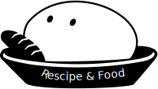
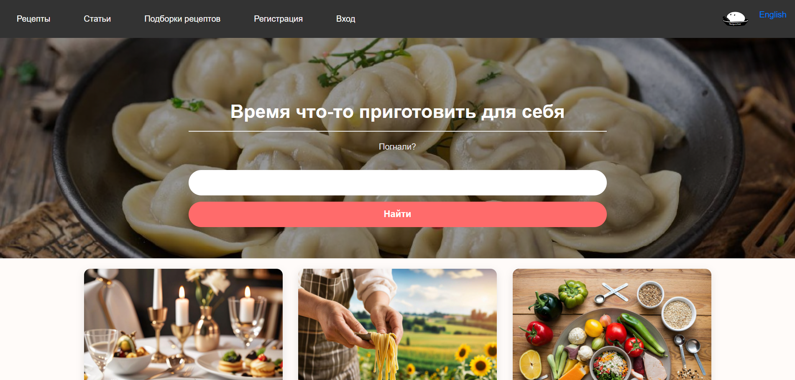
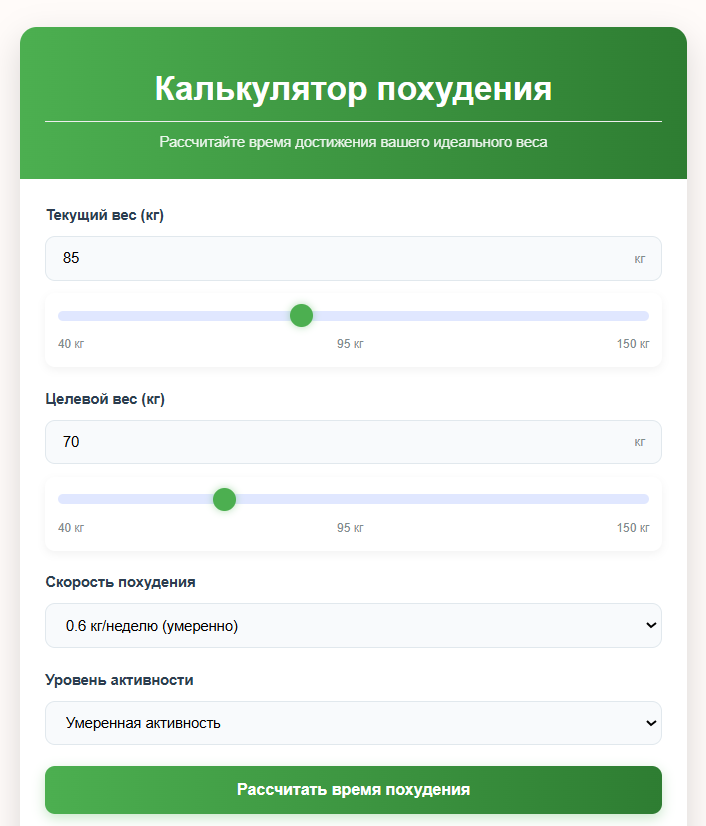
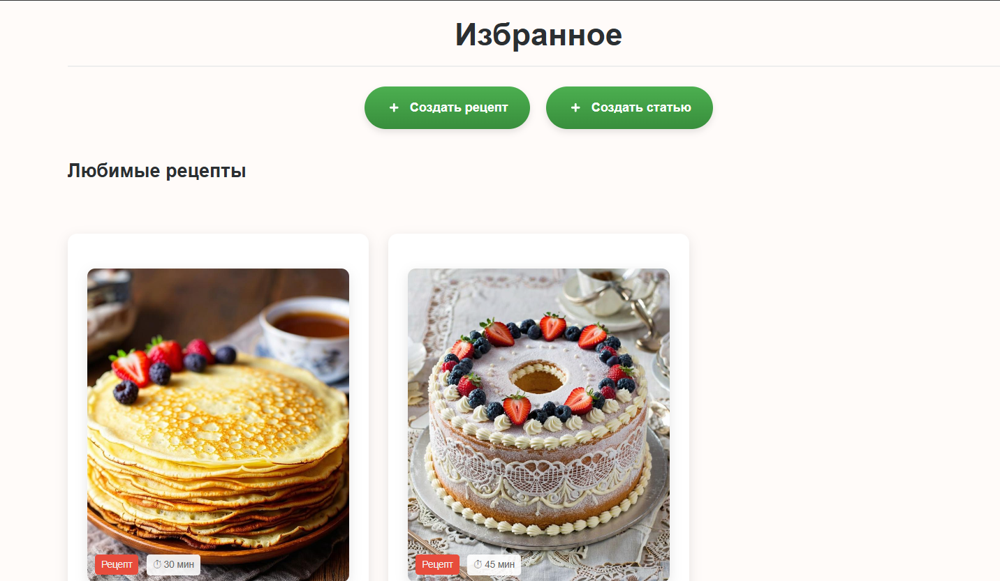
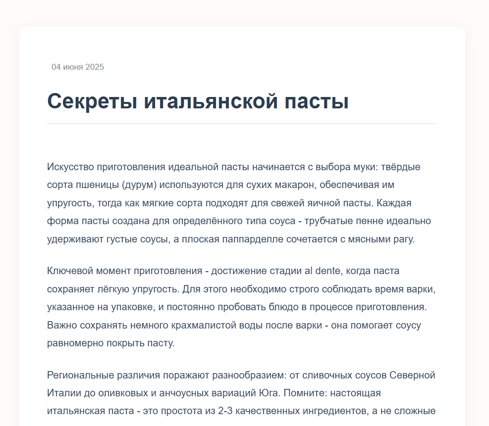
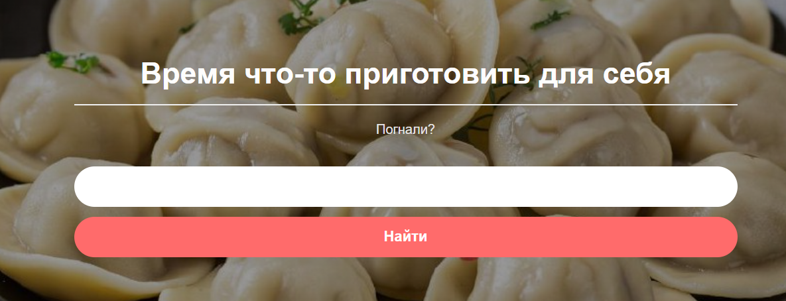

<h1 align="center">
  
</h1>

<h1 align="center">Сайт рецептов и статей по еде </h1>

  <a href="#form">структура</a> •
  <a href="#module">модули</a> •
  <a href="#functions">функционал</a> 

 <h2 name="form">Структура</h2>
  показаны не все файлы*
<pre>
cookyfood/
├─ app/
│  ├─ Controllers/
│  ├─ models/
│  ├─ Languages/
│  │  ├─ en
│  │  ├─ ru
├─ config/
│  ├─ config.php
│  ├─ routes.php
├─ core/
├─ helpers/
├─ public/
│  ├─ assets/
│  ├─ favicon.ico
│  ├─ index.php
├─ .gitignore
├─ composer
├─ package.json
├─ README.md
</pre>
<h2 name="functions"> Функционал</h2>

домашняя страница (есть 2 версии английская и русская)

калькулятор похудения

корзина избранное 

создание, редакция статей (и рецептов)

поиск по статьям и рецептов

<h2 name="module">Модули проекта</h2>

<ul>
  <li>Application</li>
  <li>Auth</li>
  <li>Database</li>
  <li>File</li>
  <li>Language</li>
  <li>Model</li>
  <li>Pagination</li>
  <li>Request</li>
  <li>Response</li>
  <li>Router</li>
  <li>Session</li>
  <li>Validator</li>
</ul>

